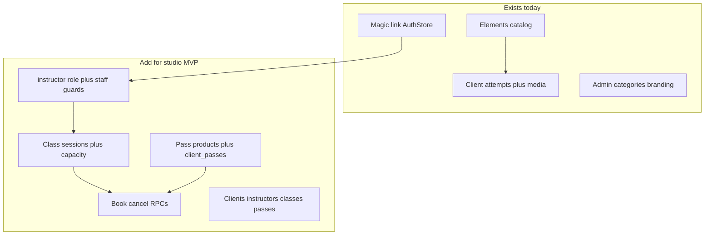
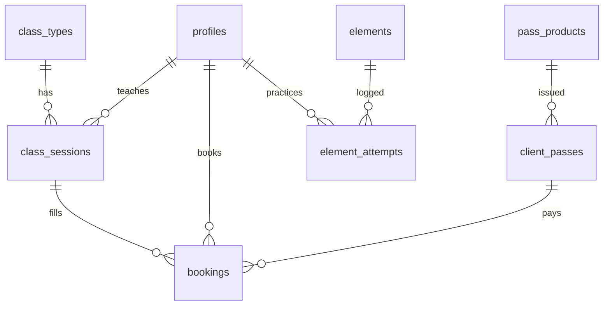

# Pole Progress MVP architectural roadmap

## Audit: what already works

The repo is a **single-tenant trick catalog**, not a studio-management app yet. Auth, branding, and progress logging are real; schedule, bookings, passes, instructors, and client admin are absent.

**Keep and reuse (do not rewrite):**
- Bootstrap: [`apps/app/src/main.ts`](apps/app/src/main.ts), [`apps/app/src/app/app.config.ts`](apps/app/src/app/app.config.ts), [`apps/app/src/app/app.routes.ts`](apps/app/src/app/app.routes.ts)
- Auth: magic-link in [`libs/core/auth`](libs/core/auth), `AuthStore` signals, `authOnlyGuard` / `adminOnlyGuard`
- Data: [`libs/core/data`](libs/core/data) (`CatalogApi`, `AttemptsApi`, `MediaApi`, `BrandingService`)
- UI: [`libs/features/shell`](libs/features/shell) (`AppShellPage`, `ToastService`, `StateBlockComponent`), catalog dashboard + element attempts, admin categories/elements/branding
- Patterns: standalone + `inject()` + signals + `OnPush` + Tailwind; Nx tags `scope:app|feature|core`; `@org/data` must not import `@org/auth`

**Current domain (Postgres):** `profiles.role` is only `'admin' | 'student'` ([`supabase/migrations/202601240001_init.sql`](supabase/migrations/202601240001_init.sql)). RLS is own-row for attempts/media; catalog/settings writes are admin-only ([`202601240002_rls.sql`](supabase/migrations/202601240002_rls.sql)). Default new user = `student`. Admin is a one-time SQL update.

**Gaps vs requested MVP:**

| Pillar | Status |
|---|---|
| Auth + Client vs Admin | Partial: no `instructor`; UI says student; admin cannot list/assign clients |
| Schedule + bookings + cancel | Missing |
| Passes + remaining classes + deduct on book | Missing |
| Progress (tricks, stages, instructor notes) | Partial: client attempts + notes; no stages; instructors cannot see/edit client progress |
| Admin: classes, instructors, passes, capacity, clients | Missing (only catalog + branding) |



## Product decisions (locked for this plan)

1. **Three roles:** keep DB enum value `student` (avoid painful enum rewrites); treat it as **Client** in UI. Add `instructor`. `admin` stays superuser.
2. **No payments.** Admin issues/revokes passes by hand. Stripe is out of MVP.
3. **Keep the existing catalog** as Progress. Add a `stage` on attempts (or a small lookup) and instructor notes with staff RLS — do not replace the element grid.
4. **Atomic booking in Postgres RPCs**, not in Angular. Client-side deduct will race on capacity/credits.
5. **AnalogJS stays test-only** (`@analogjs/vite-plugin-angular` / Vitest). Runtime remains `@angular/build` + `npx nx serve app`.

**Permissions:**
- **Client (`student`):** book/cancel own slots, see own passes, own progress.
- **Instructor:** own/assigned sessions roster; add progress notes/stages; cannot edit branding, roles, or pass products.
- **Admin:** all of the above + CRUD classes/sessions, assign instructors, issue passes, client list, catalog, branding, role changes.

## Target Nx layout

Keep path aliases in [`tsconfig.base.json`](tsconfig.base.json). Add two feature libs; **do not** add a `scope:ui` library until copy/paste of Tailwind controls becomes painful (saves generator/token cost).

```
apps/app                          # routes only; wire new loadChildren
libs/core/auth                    # UserRole + instructor/staff guards
libs/core/data                    # models + ScheduleApi, BookingsApi, PassesApi, ClientsApi
libs/features/shell               # nav: Schedule, Passes, Progress
libs/features/schedule            # NEW @org/schedule — week calendar + book/cancel
libs/features/passes              # NEW @org/passes — my passes + remaining
libs/features/dashboard + element # Progress (extend stages + instructor view)
libs/features/admin               # extra pages: classes, clients, passes, instructors
supabase/migrations               # one file per session, never edit applied SQL
```

Generate libs with:

`npx nx g @nx/angular:library --directory=libs/features/schedule --name=schedule --standalone --skipModule --unitTestRunner=vitest-analog --linter=eslint --tags=scope:feature`

Same for `passes`.

**Route map (target):**
- `/app` — Progress (existing dashboard)
- `/app/schedule` — week calendar
- `/app/passes` — client passes
- `/app/elements/:id` — existing + stage/instructor notes
- `/admin/classes`, `/admin/clients`, `/admin/passes`, `/admin/instructors` + existing catalog/branding
- Instructors use `/admin/classes` (roster) and Progress; branding/role tabs stay `adminOnlyGuard`

## Data model (new migrations)

Add after existing `20260124000*` files (do not rewrite them).

**Roles / helpers:** alter `user_role` add `instructor`; `is_instructor()`, `is_staff()` (`admin OR instructor`); RLS: staff can `select` all `profiles`; only admin `update` `profiles.role`.

**Studio settings:** `app_settings.default_capacity`, `cancel_cutoff_hours` (extend singleton).

**Schedule:**
- `class_types` — name, duration_min, default_capacity, active
- `class_sessions` — type_id, instructor_id → profiles, starts_at, ends_at, capacity, status (`scheduled|cancelled`)
- Unique `(instructor_id, starts_at)` optional later

**Bookings:**
- `bookings` — session_id, user_id, pass_id, status (`booked|cancelled`), unique `(session_id, user_id)` where booked
- RPC `book_session(session_id)` — lock session, check capacity, pick valid pass (`remaining > 0` and `valid_until >= now()`), insert booking, decrement remaining
- RPC `cancel_booking(booking_id)` — before cutoff restore credit; after cutoff keep deducted (configurable)

**Passes:**
- `pass_products` — name, class_count, validity_days, active (admin)
- `client_passes` — user_id, product_id, remaining, valid_from, valid_until, status

**Progress (extend, don’t replace):**
- `element_attempts.stage` text/enum (`trying|in_progress|held|mastered`) default `trying`
- RLS: staff select/insert notes on any client attempt; clients remain own-row
- Optional `progress_notes` if instructor comments must be separate from the client’s attempt note

**Seed:** 2 class types, 1 week of sessions, 1 pass product, 1 demo client pass.



## Month plan (8 Cursor sessions)

Work **one session = one PR-sized chat**. Start each chat with the session id and “only these files”. Run `npx nx serve app` + `supabase db reset` only when that session touches SQL.

### Week 1 — Foundation (sessions 1–2)

**Session 1 — Roles + nav (no booking UI yet)**
- [`supabase/migrations/2026XXXX_roles_instructor.sql`](supabase/migrations/) — enum value, `is_staff()`, profile RLS
- [`libs/core/data/src/lib/models.ts`](libs/core/data/src/lib/models.ts), [`libs/core/auth/src/lib/profiles.api.ts`](libs/core/auth/src/lib/profiles.api.ts), [`libs/core/auth/src/lib/auth.store.ts`](libs/core/auth/src/lib/auth.store.ts) — `isInstructor`, `isStaff`
- New [`libs/core/auth/src/lib/staff-only.guard.ts`](libs/core/auth/src/lib/staff-only.guard.ts)
- Copy: Client vs Instructor vs Admin in [`sign-in.page.ts`](libs/core/auth/src/lib/pages/sign-in.page.ts), [`app-shell.page.ts`](libs/features/shell/src/lib/pages/app-shell.page.ts)
- [`readme.md`](readme.md) bootstrap snippet for instructor

**Session 2 — Schema for classes / bookings / passes (SQL + types only)**
- One migration: tables + indexes + RLS (no Angular pages)
- Types + empty API stubs in [`libs/core/data`](libs/core/data): `schedule.api.ts`, `bookings.api.ts`, `passes.api.ts`
- Seed sessions + pass product
- Verify in Studio; no UI

### Week 2 — Schedule (sessions 3–4)

**Session 3 — Client calendar (read-only)**
- Generate `@org/schedule`
- `SchedulePage` week view (start with a **week list**, not a full calendar lib)
- Wire [`shell.routes.ts`](libs/features/shell/src/lib/shell.routes.ts) `/app/schedule`
- `ScheduleApi.listSessionsInRange`

**Session 4 — Book + cancel**
- SQL RPCs `book_session` / `cancel_booking`
- [`bookings.api.ts`](libs/core/data) calls RPCs only
- Buttons + capacity (`booked_count / capacity`) + toast errors (full class, no pass, cutoff)
- Thin Playwright spec in [`apps/app-e2e`](apps/app-e2e) for signed-in book happy path (skip if local Supabase is down)

### Week 3 — Passes + admin issue (sessions 5–6)

**Session 5 — Client passes UI**
- Generate `@org/passes`
- `MyPassesPage`: remaining, validity, which pass will be used next
- Shell nav link

**Session 6 — Admin issue pass + class CRUD**
- Admin pages: `classes.page.ts` (types + upcoming sessions + capacity), `passes.page.ts` (products + issue to user by email/id)
- `staffOnlyGuard` on classes roster; `adminOnlyGuard` on issuing passes
- Extend [`admin.routes.ts`](libs/features/admin/src/lib/admin.routes.ts) + [`admin-shell.page.ts`](libs/features/admin/src/lib/pages/admin-shell.page.ts)

### Week 4 — People, progress, polish (sessions 7–8)

**Session 7 — Clients + instructors**
- `clients.page.ts` list/search profiles, admin sets role
- `instructors.page.ts` assign instructor to sessions
- `ClientsApi` / profile updates; never allow clients to self-promote (`with check` blocks role change unless `is_admin()`)

**Session 8 — Progress stages + instructor notes + hardening**
- Attempt `stage` + staff RLS
- Instructor can open a client’s element timeline (query param or `/admin/clients/:id/progress`)
- Cancellation cutoff + empty/error states
- Smoke: `npx nx build app`, lint on touched libs, update [`readme.md`](readme.md) routes and `supabase start` notes

## Implementation rules (Angular 21 / Nx)

- Feature stores: `signal` state + computed, `providedIn` page-level like [`ElementStore`](libs/features/element/src/lib/element.store.ts)
- All Supabase I/O in `@org/data` (or auth); pages do not call `SUPABASE_CLIENT` except existing admin storage helper
- Booking mutations **only** via RPC
- Reuse `StateBlockComponent` / `ToastService`
- Ukrainian UI copy to match current pages
- New code: standalone, `ChangeDetectionStrategy.OnPush`, Tailwind only
- Commands: `npx nx serve app`, `npx nx test <lib>`, `npx nx lint <lib>`

## Cursor free-plan discipline

- One session prompt per chat; paste the session’s file list
- Do not ask the agent to “implement the whole MVP”
- Prefer editing existing libs over new shared abstractions
- Skip FullCalendar / extra UI kits; CSS grid week list is enough
- Do not regenerate Nx workspace or Analog SSR
- After each session: `supabase db reset` if SQL changed, then click the one flow in the browser

## Explicitly out of month-1 MVP

Payments, multi-studio, waitlists, recurring generation UI beyond “create N days”, mobile native, email/SMS reminders, Analog file-based routing, replacing magic-link auth.
