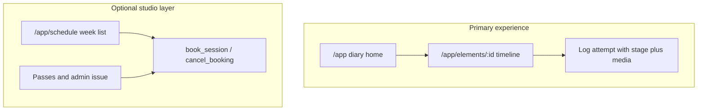

# Pole Progress roadmap

## Product focus

The primary value is the **student's personal training diary and progress tracker**.

- `/app` is the diary home (element grid, current stage per element).
- `/app/elements/:id` is the element diary: log an attempt with a stage, then read a chronological photo/video timeline.
- Stages are `trying | in_progress | held | mastered`. The current stage is the **latest attempt by date**, so a later regression replaces an older "mastered".

Schedule, bookings, and passes **stay in the codebase**. They are not deleted. The shell shows **Щоденник** as the primary item and **Розклад** as a quieter optional item. Do not put new studio-ops work ahead of the diary.

## Already in the tree

Keep and extend. Do not rewrite.

- Auth, branding, catalog, attempts, media: [`libs/core/auth`](libs/core/auth), [`libs/core/data`](libs/core/data), [`libs/features/dashboard`](libs/features/dashboard), [`libs/features/element`](libs/features/element)
- Roles: `student` (UI: Клієнт), `instructor`, `admin`. Staff helpers in [`supabase/migrations/202610070001_roles_instructor.sql`](supabase/migrations/202610070001_roles_instructor.sql)
- Optional studio schema and UI: schedule week list, `book_session` / `cancel_booking`, pass balances on the schedule page. Routes stay. Nav emphasis does not.

## Session 4 — diary stages and media timeline

This session. Diary first; schedule code untouched except the shell link.

- Migration [`supabase/migrations/202610080003_attempt_stages.sql`](supabase/migrations/202610080003_attempt_stages.sql): `attempt_stage` enum and `element_attempts.stage` default `trying`
- [`libs/core/data`](libs/core/data): stage on `ElementAttempt` / `CreateAttemptInput`, `listMyProgressRows()`, stage rank and summary helpers
- Add-attempt dialog: required stage (`Пробую`, `В процесі`, `Утримую`, `Опановано`), defaulting to the element's latest stage
- Element page: stage stepper for the current stage, chronological timeline (oldest first) with forward/back markers and full-width photos/videos
- Diary home: stage counts and a stage pill on each card that has attempts
- Shell: **Щоденник** primary, **Розклад** optional. Admin link unchanged
- Apply with `supabase db reset` (or `supabase migration up` if the local DB should keep its data)

## Upcoming

One session per chat. Diary sessions before optional studio sessions.

### Session 5 — diary home

- A short "recent attempts" list on `/app` across elements, not only inside one element
- Filter the grid by stage, in addition to "with records / without records"
- Empty state that tells a new student to open an element and log the first attempt

### Session 6 — instructor on the student's diary

- Staff can open one client's element timeline (query param or `/admin/clients/:id/progress`)
- Instructor note distinct from the student's own attempt note
- RLS: staff select/insert notes; clients stay on their own rows; instructors still cannot edit branding, roles, or pass products

### Session 7 — optional passes page

- `@org/passes` only if the studio layer is still wanted
- `MyPassesPage` linked from the same secondary nav as Розклад, not from the diary home

### Session 8 — optional admin studio ops

- Classes, issue passes, client list, role assignment
- Smoke: `npx nx build app`, lint on touched libs, readme routes
- Skip this session entirely if the diary is the only thing the studio will use

## Implementation rules (Angular 21 / Nx)

- Feature stores: private `signal` state, public `computed`, `inject()`, page-level `providedIn` like [`ElementStore`](libs/features/element/src/lib/element.store.ts)
- Supabase I/O stays in `@org/data` (or auth). `@org/data` must not import `@org/auth`
- Booking mutations stay RPC-only. Do not reimplement them in Angular
- Ukrainian UI copy
- Standalone, `ChangeDetectionStrategy.OnPush`, Tailwind only
- Commands: `npx nx serve app`, `npx nx test <lib>`, `npx nx lint <lib>`

## Explicitly out of scope

Payments, multi-studio, waitlists, mobile native, email/SMS reminders, Analog file-based routing, replacing magic-link auth, deleting the schedule/booking module.
